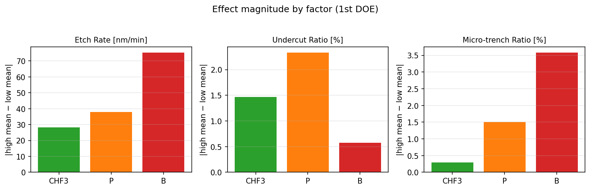
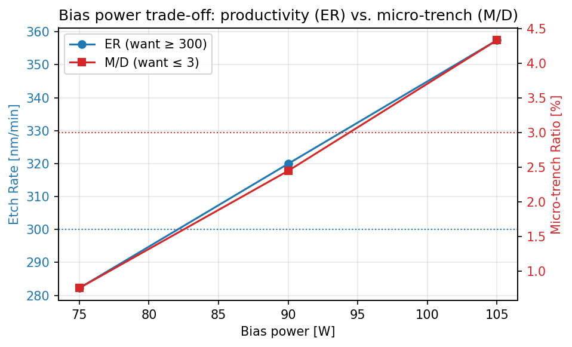
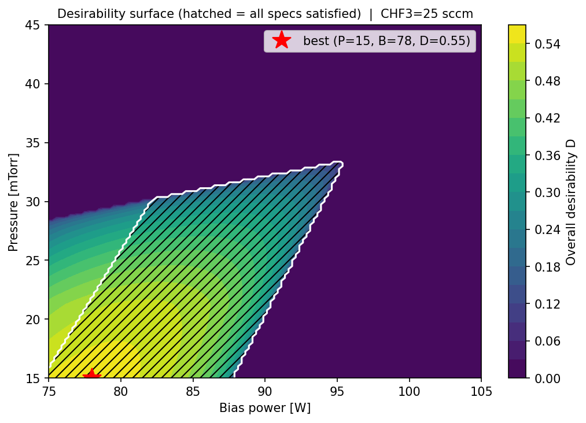
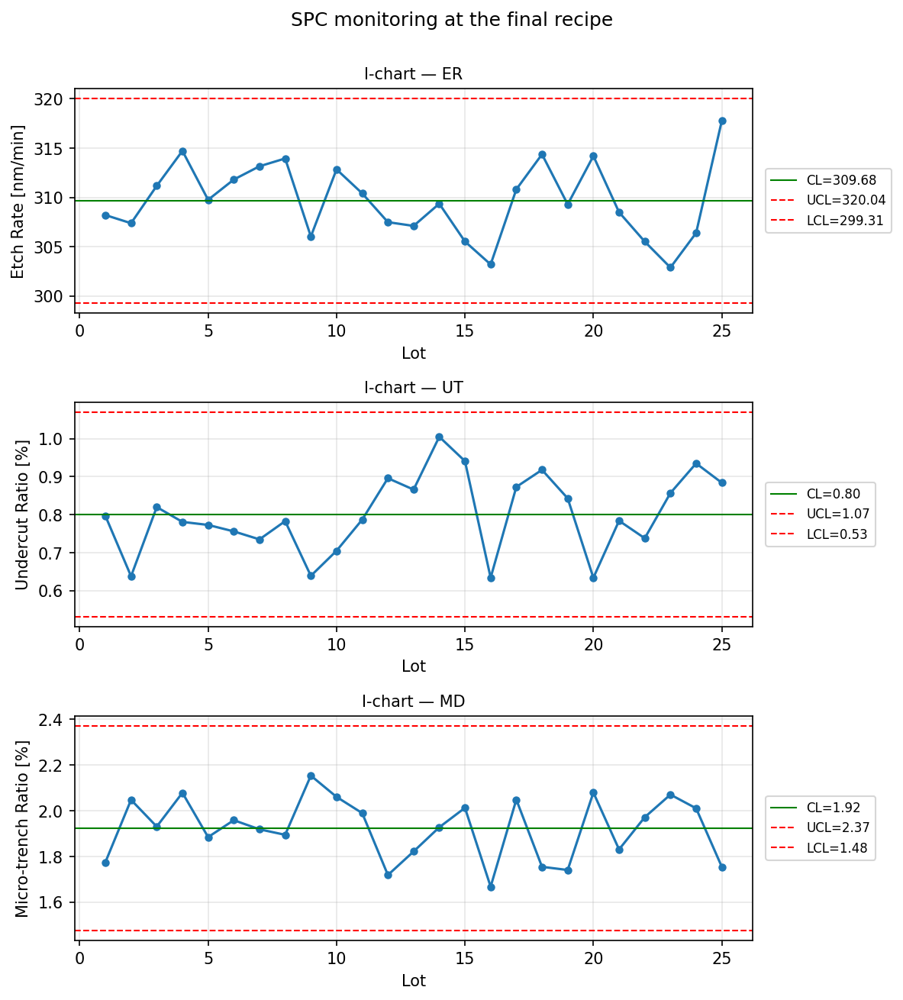

# etch-doe-optimizer

**반도체 SiO₂ 플라즈마 식각 프로파일 최적화 — DOE 기반 다중 반응 동시 최적화 파이프라인**

> ⚠️ **이 프로젝트의 모든 데이터는 물리 모델 기반 시뮬레이션으로 생성한 것입니다.**
> 실제 장비/팹 측정 데이터가 아니며, 교육 프로그램에서 수행한 팀 프로젝트의 문제 설정을
> 개인 학습·포트폴리오 목적으로 **코드 레벨에서 처음부터 재구현**한 것입니다.
> 교육 자료의 이미지·데이터는 사용하지 않았습니다.

---

## 1. 문제 배경

SiO₂ 플라즈마 식각 공정에서 두 가지 프로파일 불량이 **동시에** 발생하는 상황을 다룬다.

| 불량 | 현상 | 발생 메커니즘 |
|---|---|---|
| **Undercut (U/T)** | 마스크 직하부 측벽이 횡방향으로 파여 마스크가 처마처럼 돌출 | 측벽 passivation 부족 시 방향성 없는 F 라디칼이 등방성으로 측벽 공격 |
| **Micro-trench (M/D)** | 트렌치 바닥 모서리가 중앙보다 깊게 과식각 | 측벽에서 반사된 이온이 바닥 모서리에 집중 → 국부 식각률 상승 |

두 불량을 잡으면서 생산성(Etch Rate)과 측벽 수직성(θ)까지 확보해야 한다.

**인자 (3개)**

| 인자 | 범위 | 물리적 역할 |
|---|---|---|
| CHF₃ 유량 | 20–30 sccm | ↑ → 폴리머 측벽 보호막 강화 → U/T↓, ER↓ |
| Pressure | 15–45 mTorr | ↑ → MFP 감소·이온 산란 → U/T↑, M/D↓ |
| Bias Power | 75–105 W | ↑ → 이온 에너지 증가 → ER↑, M/D↑ |

**반응변수와 목표 (4개)**

| 반응 | 목표 |
|---|---|
| ER (Etch Rate) | ≥ 300 nm/min |
| U/T (Undercut Ratio) | ≤ 2.0 % |
| M/D (Micro-trench Ratio) | ≤ 3.0 % |
| θ (측벽각) | 90° ± 3° |

세 인자 모두 부족/과다 양쪽에서 서로 다른 불량을 유발하는 **trade-off 구조**이므로,
한 인자씩 조정하는 OFAT 방식이 아닌 **DOE 기반 다중 반응 최적화**로 접근한다.

## 2. 가상 팹 (데이터 생성 모델)

실험 데이터는 아래 ground-truth 선형 모델 + 가우시안 노이즈로 생성한다
([src/data_gen.py](src/data_gen.py)에 계수의 물리적 의미를 상세히 문서화).

```
ER  = -3.00·CHF₃ - 1.20·P + 2.50·B + 206.00    (σ ≈ 5)
U/T = -0.15·CHF₃ + 0.08·P - 0.02·B + 4.95      (σ ≈ 0.10)
M/D =  0.03·CHF₃ - 0.05·P + 0.12·B - 7.55      (σ ≈ 0.15)
θ   =  90.40 + 0.08·CHF₃ - 0.11·P              (σ ≈ 0.15)
```

정답 모델을 알고 있으므로, **분석 파이프라인이 참 계수를 복원하는지 자체를 pytest로 검증**한다
— Lam Research의 Nature 논문(Kanarik et al., 2023)이 가상 공정 게임으로 인간 vs 알고리즘의
레시피 개발 비용을 벤치마크한 것과 같은 접근이다.

## 3. 파이프라인 요약

### 1차 DOE — 3인자 3수준 full factorial (27 runs)

요인별 main effect와 효과 크기를 비교하면 지배 구조가 드러난다.



| 반응 | 지배 인자 |
|---|---|
| ER, M/D | **Bias Power** (이온 에너지 직접 결정) |
| U/T | **Pressure** (이온 산란·등방성 결정) |
| — | CHF₃는 효과 최소 → 미세조정용 보조 인자 |

### 다중회귀 (statsmodels OLS)

모든 반응에서 R² > 0.98, 추정 계수는 참값을 ±2SE 내에서 복원
([results/ols_report.csv](results/ols_report.csv)).

### Trade-off: 같은 노브에 반대 요구

Bias를 올리면 ER은 좋아지고(≥300 필요) M/D는 나빠진다(≤3 필요) — 단일 반응 최적화로는 해가 없다.



### Desirability 기반 다중 반응 동시 최적화

Derringer–Suich(1980) desirability function으로 4개 반응을 D ∈ [0,1] 하나로 묶고
(기하평균 — 한 반응이라도 불만족이면 D=0), Pressure×Bias 평면을 grid search.
빗금 영역이 4개 스펙을 모두 만족하는 feasible region이다.



### 2차 DOE — 정밀 탐색 (9 runs)

1차 결과로 CHF₃를 25 sccm에 고정하고 Pressure 15–25 mTorr / Bias 60–90 W 좁은 창에서
3×3 정밀 DOE → 국소 모델 재적합 → 최종 레시피 도출.

### 최종 레시피와 검증

| | CHF₃ | Pressure | Bias |
|---|---|---|---|
| **최종 레시피** | **25 sccm** | **15 mTorr** | **79 W** |

| 반응 | 예측값 | 판정 기준 | 결과 |
|---|---|---|---|
| ER | 311.2 nm/min | ≥ 300 | **PASS** |
| U/T | 0.88 % | ≤ 2.0 | **PASS** |
| M/D | 1.96 % | ≤ 3.0 | **PASS** |
| θ | 90.7° | 90 ± 3° | **PASS** |

반복 run(n=3) 시뮬레이션으로 재현성 확인: 모든 반응이 예측값 ±3σ 밴드 내
([results/reproducibility.csv](results/reproducibility.csv)).

### SPC 확장 — 양산 관리도

최종 레시피로 25 lot을 시뮬레이션하고 I-chart(UCL/LCL = CL ± 2.66·MR̄)로 관리 상태 확인.



## 4. 왜 DOE인가 — OFAT 대비 효율

- 본 파이프라인: **총 36 runs** (27 + 9)로 4개 반응 동시 만족 조건 도출
- OFAT(한 번에 한 인자): 인자당 별도 스윕이 필요하고, 기준점 선택에 따라 결과가 달라지며,
  **Bias의 ER↔M/D 상충 구조 같은 다중 반응 간섭은 원리적으로 발견 불가**
- Kanarik et al.(2023)은 같은 문제의식(레시피 개발 비용)을 Bayesian optimization으로 확장 —
  본 프로젝트의 자연스러운 다음 단계이기도 하다

## 5. 리포지토리 구조

```
├── src/
│   ├── config.py          # 인자 범위·목표 스펙·ground truth 계수 (단일 출처)
│   ├── data_gen.py        # 가상 팹: 물리 모델 + 노이즈 데이터 생성
│   ├── doe_design.py      # full factorial / 2차 정밀 DOE 설계
│   ├── analysis.py        # main effect, 효과 크기, OLS 회귀 리포트
│   ├── optimization.py    # Derringer–Suich desirability, grid search, 검증표
│   ├── spc.py             # I-chart 통계, 재현성 리포트
│   └── visualization.py   # 모든 matplotlib 그림
├── notebooks/
│   ├── 01_first_doe.ipynb             # 문제 정의 → 1차 DOE → 효과 분석
│   ├── 02_regression_tradeoff.ipynb   # OLS 적합·계수 복원 검증·trade-off
│   └── 03_optimization_and_spc.ipynb  # 최적화 → 2차 DOE → 검증 → SPC
├── scripts/
│   ├── run_pipeline.py    # 전체 파이프라인 실행 (그림/표 재생성)
│   └── build_notebooks.py # 노트북 재생성·재실행
├── results/               # 생성된 그림·CSV (스크립트로 100% 재현 가능)
└── tests/                 # pytest: 데이터 생성·회귀 계수 복원 검증
```

## 6. 실행 방법

```bash
pip install -r requirements.txt
python scripts/run_pipeline.py   # 전체 파이프라인 + 그림 재생성
pytest tests -q                  # 단위 테스트 (13개)
```

## 7. 한계점

- 모든 데이터는 **1차 선형 ground truth 기반 시뮬레이션**이다. 실제 식각 공정은 강한
  비선형성과 교호작용(예: 폴리머 과다 축적 시 etch stop, aspect-ratio dependent etching)이 있다.
- 노이즈를 i.i.d. 가우시안으로 가정했다. 실제 장비는 시간 드리프트, 챔버 상태(PM 주기),
  lot 간 상관이 존재한다.
- U/T, M/D 등의 계측은 SEM 단면 측정 오차를 수반하지만 여기서는 무시했다.
- **실제 장비 데이터가 아니므로 도출된 레시피 수치 자체는 공학적 의미가 없다** —
  이 프로젝트의 가치는 DOE→회귀→다중 반응 최적화→SPC로 이어지는 방법론 구현에 있다.

## 8. 참고문헌 (공개 자료만)

1. K. J. Kanarik et al., "Human–machine collaboration for improving semiconductor
   process development," *Nature* 616, 707–711 (2023).
   [doi:10.1038/s41586-023-05773-7](https://doi.org/10.1038/s41586-023-05773-7)
2. G. Derringer and R. Suich, "Simultaneous Optimization of Several Response
   Variables," *Journal of Quality Technology* 12(4), 214–219 (1980).
3. M. A. Lieberman and A. J. Lichtenberg, *Principles of Plasma Discharges and
   Materials Processing*, 2nd ed., Wiley (2005). — 플라즈마 식각 물리 일반론
4. D. C. Montgomery, *Design and Analysis of Experiments*, 10th ed., Wiley (2019).
   — full factorial 설계·반응표면·desirability
5. DISCO Corporation Technology Library (공개 기술 문서) — dicing/etch 공정 일반 자료.
   https://www.disco.co.jp/eg/solution/library/
6. spotdesirability (Python desirability 구현 오픈소스, 참고용):
   https://github.com/sequential-parameter-optimization/spotdesirability

---

**© 2026 Yoon (yoontf0@gmail.com). All rights reserved.**

이 저장소의 코드·문서·그림의 무단 복제, 수정, 재배포를 금지합니다.
개인 포트폴리오 열람 목적 외의 사용은 사전 서면 동의가 필요합니다.
